# **SOFTWARE Y HARDWARE**
## SOFTWARE:

### _SISTEMA OPERATIVO:_
###### Es un conjunto de programas que permite manejar la memoria, disco, medios de almacenamiento de información y los diferentes periféricos o recursos de nuestra computadora, como son el teclado, el mouse, la impresora, la placa de red, entre otros.Se ocupa de gestionar la memoria de nuestro sistema y la carga de los diferentes programas, para ello cada programa tiene una prioridad o jerarquía y en función de la misma contará con los recursos de nuestro sistema por más tiempo que un programa de menor prioridad.
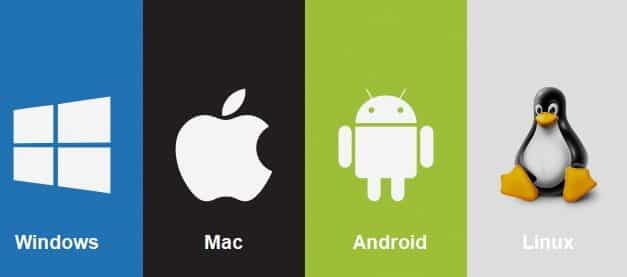

### _APLICACIONES DE USUARIO:_
###### Una aplicación es un programa diseñado como herramienta para permitir a un usuari0 realiar uno o diversos tipos de programas, como los sistemas operativos, las utilidades, y las herramientas de desarrollo de software

### _DRIVERS:_
###### Es un software o programa que  sirve de intermediario entre un dispositivo de hardware y el sistema operativo.  Su finalidad es la de permitir extraer el máximo de las funcionalidades del dispositivo para el cual ha sido diseñado.
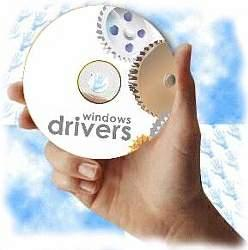

### _SOFTWARE DE DESARROLLO_
###### El software de desarrollo, también conocido como herramientas de desarrollo de software o entornos de desarrollo integrado (IDE), se refiere a una categoría de aplicaciones diseñadas para ayudar a los desarrolladores a crear, depurar, mantener y soportar otros programas y aplicaciones. Estas herramientas proporcionan un conjunto de funcionalidades que facilitan el proceso de desarrollo de software.

## HARDWARE:
##### El hardware se compone de:

1. CPU
2. RAM
3. Almacenamiento:
- HDD
- SSD
4. Placa base
5. Dispositivos de entrada y de salida
6. Buses:
- De datos
- De dirección

### _CPU (Unidad Central de Procesamiento):_
###### Un componente básico de todo dispositivo que procesa datos y realiza cálculos matemáticos-informáticos. El CPU proporciona la capacidad de programación y, junto con la memoria y los dispositivos de entrada/salida, es uno de los componentes presentes en la historia de los ordenadores. Algunas de las funciones básicas del CPU son recolectar información, decodificarla en partes menores y llevar a cabo instrucciones, que luego ejecuta.

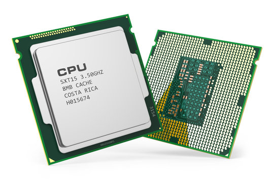

### _RAM (Memoria de Acceso Aleatorio):_
###### Es la memoria principal de un dispositivo, esa donde se almacenan de forma temporal los datos de los programas que estás utilizando en este momento. La memoria RAM tiene dos características que la diferencian del resto de tipos de almacenamiento. Por una parte tiene una enorme velocidad, y por otra los datos sólo se almacenan de forma temporal. Esto quiere decir que cada vez que reinicies o apagues tu ordenador, lo normal es que los datos que haya almacenados en la RAM se pierdan.

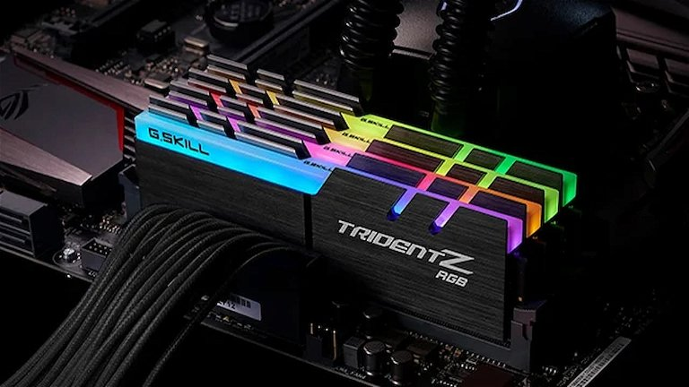

### _Almacenamiento:_
#### - HDD:
###### Los discos duros, también conocidos como HDD, son un componente informático que sirve para almacenar de forma permanente tus datos. Esto quiere decir, que los datos no se borran cuando se apaga la unidad como pasa en los almacenados por la memoria RAM.
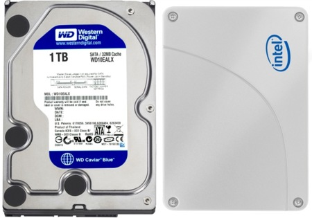
#### - SSD:
###### Las unidades SSD almacenan los datos mediante una memoria basada en flash, que es mucho más rápida que los discos duros tradicionales a los que han venido a sustituir. Las unidades SSD tampoco tienen piezas móviles, por lo que actualizarlas a una es una excelente manera de acelerar su ordenador y hacerlo más resistente. 

### _PLACA BASE:_
###### Es un circuito impreso al que se conectan el resto de los componentes de un ordenador para que estos funcionen de manera óptima. También se las conoce con el nombre de placas madre.

###### Su función es que todos los elementos esenciales de un PC cuenten con energía eléctrica para responder en todo momento de manera adecuada y coordinar los flujos de datos.
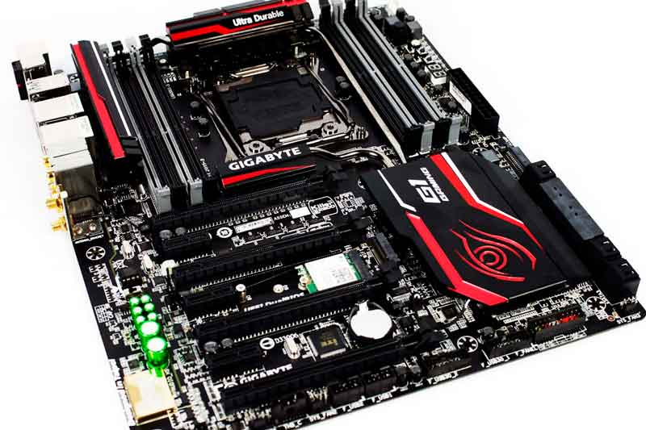

### _DISPOSITIVOS DE ENTRADA Y SALIDA:_
######  Es un dispositivo independiente, conectado externa o internamente a la tarjeta madre, que permite al sistema informático realizar una función extra. Como tal, no forma parte del proceso central de una computadora, sino que sirve a nivel de complemento para aumentar sus capacidades funcionales.

###### Los dispositivos periféricos son los responsables de realizar las operaciones de entrada y salida de un sistema informático. Estos artefactos se conectan a través de diversos puertos, dependiendo de la naturaleza de cada dispositivo y su conector. Algunos de estos puertos son: USB, paralelo, en serie, de audio, VGA, MIDI, y ethernet.
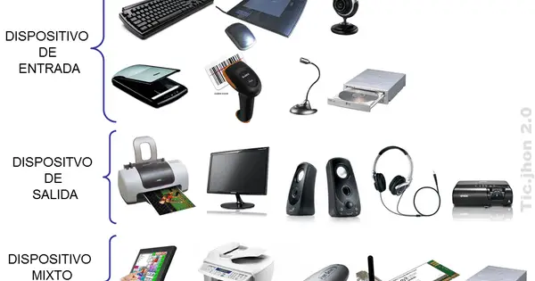

### _BUSES:_
#### DE DATOS:
###### Es un tipo de bus de comunicación en el que se transmiten los datos entre los diferentes componentes de una computadora o sistema. La información puede fluir en ambas direcciones, ya sea desde el ordenador hacia otros dispositivos, o desde los propios dispositivos hacia el ordenador.

###### En algunos casos, el bus de datos también puede enviar información adicional a los propios datos, como por ejemplo, bits de dirección o información sobre determinadas condiciones.

#### DE DIRECCIÓN:
###### Es un componente separado del bus de datos en un sistema cuya función principal es transmitir la dirección de memoria de la información que se desea acceder o transmitir.

###### Consiste en un grupo de líneas eléctricas que se utilizan para establecer la dirección de memoria a la que se desea acceder.
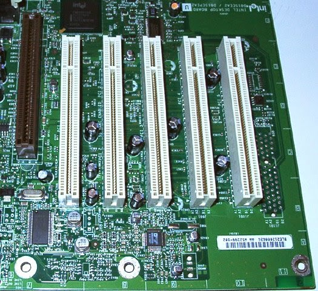
#### _Diagrama que resume la informaación presentada:_

### _¿Cómo interactúa el hardware con el software, cuál es la función de cada uno?_
###### El hardware y el software interactúan de manera simbiótica, el hardware proporciona la capacidad física necesaria, mientras que el software ofrece las instrucciones y la lógica para realizar diversas tareas.
###### Ambos son indispensables y dependen el uno del otro para un rendimiento óptimo.
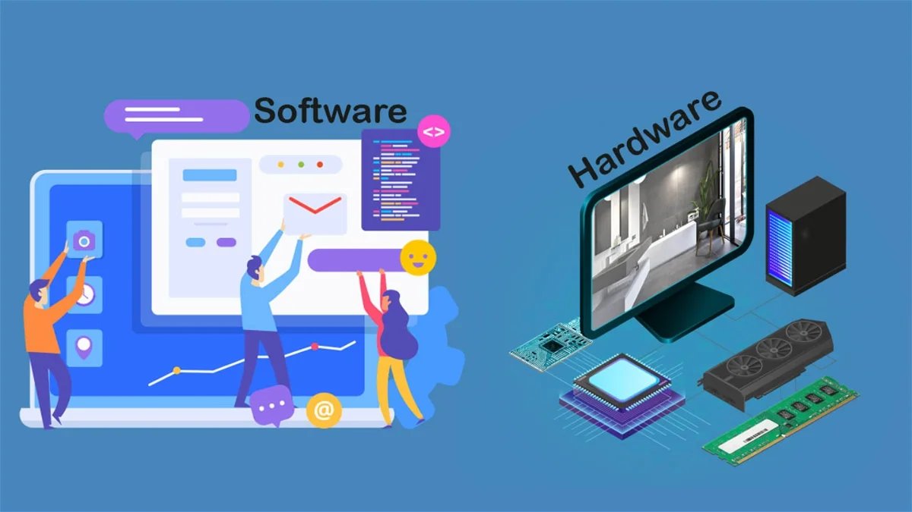

### _¿Cuál es la función de la CPU y cuáles son sus partes más importantes?_

###### La **Unidad Central de Procesamiento (CPU)**, conocida como el "cerebro" del computador, es responsable de ejecutar las instrucciones de los programas y realizar cálculos. Sus funciones principales incluyen:

- ###### **Interpretar y ejecutar instrucciones**: La CPU toma las instrucciones de los programas almacenados en la memoria, las decodifica y las ejecuta.
- ###### **Realizar operaciones aritméticas y lógicas**: Utiliza la Unidad Aritmética Lógica (ALU) para llevar a cabo operaciones matemáticas y lógicas.
- ###### **Controlar el flujo de datos**: La Unidad de Control coordina las actividades de los demás componentes del sistema, asegurando que las instrucciones se ejecuten en el orden correcto.

### Partes más importantes de la CPU:

1. ###### **Núcleo (Core)**: Es la unidad básica que interpreta y ejecuta instrucciones. Los procesadores modernos pueden tener múltiples núcleos, lo que permite realizar varias tareas simultáneamente.
2. ###### **Unidad de Control**: Extrae las instrucciones de la memoria, las decodifica y las ejecuta, coordinando las operaciones del sistema.
3. ###### **Unidad Aritmética Lógica (ALU)**: Realiza operaciones matemáticas y lógicas entre los datos.
4. ###### **Memoria Caché**: Almacena datos temporales para un acceso rápido, mejorando la eficiencia del procesamiento.
5. ###### **Registros**: Pequeñas unidades de almacenamiento dentro de la CPU que contienen datos e instrucciones que se están utilizando actualmente.
6. ###### **Bus**: Sistema de comunicación que transfiere datos entre la CPU y otros componentes del sistema.
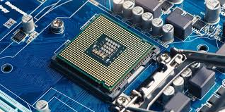

### _¿Qué es la velocidad de la CPU, también conocida como velocidad del reloj?_
###### Se refiere a la frecuencia a la que la unidad central de procesamiento (CPU) ejecuta sus operaciones básicas. Se mide en **gigahercios (GHz)**, donde cada gigahercio equivale a mil millones de ciclos por segundo.

##### **Importancia de la Velocidad del Reloj**
- ###### **Rendimiento**: Una mayor velocidad del reloj permite que la CPU procese más instrucciones por segundo, lo que generalmente se traduce en un mejor rendimiento del sistema.
- ###### **Eficiencia**: La velocidad del reloj, junto con la arquitectura del procesador y otros factores como la cantidad de núcleos, determina la eficiencia con la que la CPU puede manejar tareas complejas.
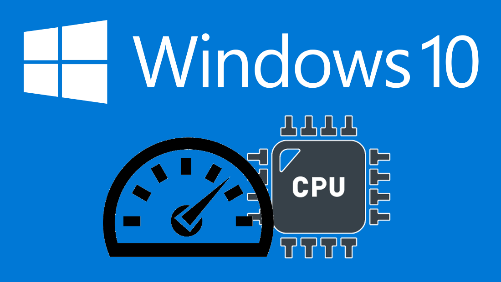

### _¿Cuál es la secuencia de pasos que ocurre, desde el momento en que presionas el botón de encendido de la computadora, hasta que se muestra el sistema operativo listo para funcionar?_
###### 

1. ###### **Presionar el Botón de Encendido**:
   ###### Al presionar el botón de encendido, la fuente de alimentación (PSU) suministra energía a todos los componentes del sistema.

2. ###### **Power-On Self-Test (POST)**:
   ###### La BIOS (Sistema Básico de Entrada/Salida) o UEFI (Interfaz de Firmware Extensible Unificada) realiza una serie de pruebas para verificar que el hardware esencial (como la memoria RAM, el procesador y los dispositivos de almacenamiento) funcione correctamente.

3. ###### **Inicialización del BIOS/UEFI**:
   ###### La BIOS/UEFI configura y inicializa el hardware del sistema. Esto incluye la configuración de la memoria, la detección de dispositivos de almacenamiento y la configuración de otros periféricos.

4. ###### **Búsqueda del Dispositivo de Arranque**:
   ###### La BIOS/UEFI busca en la lista de dispositivos de arranque (como discos duros, SSDs, unidades USB) hasta encontrar uno con un registro de arranque maestro (MBR) o una tabla de particiones GUID (GPT) válida.

5. ###### **Carga del Gestor de Arranque (Bootloader)**:
   ###### El gestor de arranque, como BOOTMGR para Windows o GRUB para Linux, se carga en la memoria y toma el control del proceso de arranque.

6. ###### **Carga del Sistema Operativo**:
   ###### El gestor de arranque carga el núcleo del sistema operativo (kernel) en la memoria RAM y transfiere el control al sistema operativo.

7. ###### **Inicialización del Sistema Operativo**:
   ###### El sistema operativo inicializa sus propios controladores y servicios, configura el entorno de usuario y carga las aplicaciones necesarias para el funcionamiento básico.

8. ###### **Pantalla de Inicio de Sesión**:
   ###### Finalmente, el sistema operativo muestra la pantalla de inicio de sesión o el escritorio, listo para que el usuario interactúe con el sistema.
   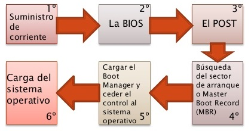

### _Comentarios de la actividad:_
###### Me considero una persona con nulo conocimiento técnico informático, debido a esto casi la totalidad de la actividad me enseñó conceptos nuevos.
###### Como por ejemplo todo lo que ocurre al momento de encender el computador que a ojos de un mortal parecería ser algo simple por el corto tiempo que transcurre en el encendido, sin embargo es todo lo contrario.
###### Considero que la actividad fue beneficiosa y conveniente para futuras ocasiones en mi vida, como lo puede ser comprar las piezas de mi propio PC personalizado ;) .

#### REFERENCIAS:
- [Extraido de https://advantecnia.com/tipos-de-buses-de-comunicacion/#:~:text=Un%20bus%20de%20datos%20o,propios%20dispositivos%20hacia%20el%20ordenador.](https://advantecnia.com/tipos-de-buses-de-comunicacion/#:~:text=Un%20bus%20de%20datos%20o,propios%20dispositivos%20hacia%20el%20ordenador.)
- [Extraido de https://desarrollarinclusion.cilsa.org/tecnologia-inclusiva/que-es-un-sistema-operativo/](https://desarrollarinclusion.cilsa.org/tecnologia-inclusiva/que-es-un-sistema-operativo/)
- [Extraido de https://es.slideshare.net/slideshow/sistemas-operativos-y-aplicaciones-de-usuario/137189764](https://es.slideshare.net/slideshow/sistemas-operativos-y-aplicaciones-de-usuario/137189764)
- [Extraido de https://servicioalpc.com/que-son-los-drivers-o-controladores/](https://servicioalpc.com/que-son-los-drivers-o-controladores/)
- [Extraido de https://concepto.de/cpu/](https://concepto.de/cpu/)
- [Extraido de https://www.avast.com/es-es/c-what-is-ssd](https://www.avast.com/es-es/c-what-is-ssd)https://www.xataka.com/basics/hdd-vs-ssd#:~:text=Los%20discos%20duros%2C%20tambi%C3%A9n%20conocidos,almacenados%20por%20la%20memoria%20RAM.
- [https://www.xataka.com/basics/hdd-vs-ssd#:~:text=Los%20discos%20duros%2C%20tambi%C3%A9n%20conocidos,almacenados%20por%20la%20memoria%20RAM.](https://www.xataka.com/basics/hdd-vs-ssd#:~:text=Los%20discos%20duros%2C%20tambi%C3%A9n%20conocidos,almacenados%20por%20la%20memoria%20RAM.)
- [Extraido de https://www.xataka.com/basics/memoria-ram-que-sirve-como-mirar-cuanta-tiene-tu-ordenador-movil](https://www.xataka.com/basics/memoria-ram-que-sirve-como-mirar-cuanta-tiene-tu-ordenador-movil)
- [Extraido de https://www.pccomponentes.com/que-es-una-placa-base-tipos-instalar](https://www.pccomponentes.com/que-es-una-placa-base-tipos-instalar)
- [Extraido de https://www.ceupe.com/blog/periferico.html?dt=1721786290381](https://www.ceupe.com/blog/periferico.html?dt=1721786290381)
- [Extraido de https://tutomaniac.com/como-funciona-el-hardware-y-el-software-juntos/](https://tutomaniac.com/como-funciona-el-hardware-y-el-software-juntos/)

- [Extraido de https://concepto.de/cpu/](https://concepto.de/cpu/)
- [Extraido de https://www.pccomponentes.com/partes-de-un-cpu](https://www.pccomponentes.com/partes-de-un-cpu)
- [Extraido de https://adictec.com/que-es-reloj-procesador/](https://adictec.com/que-es-reloj-procesador/)
- [Extraido de https://administraciondesistemas.com/secuencia-arranque-ordenador-boot/](https://administraciondesistemas.com/secuencia-arranque-ordenador-boot/)