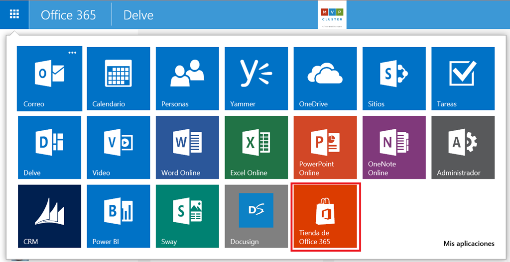
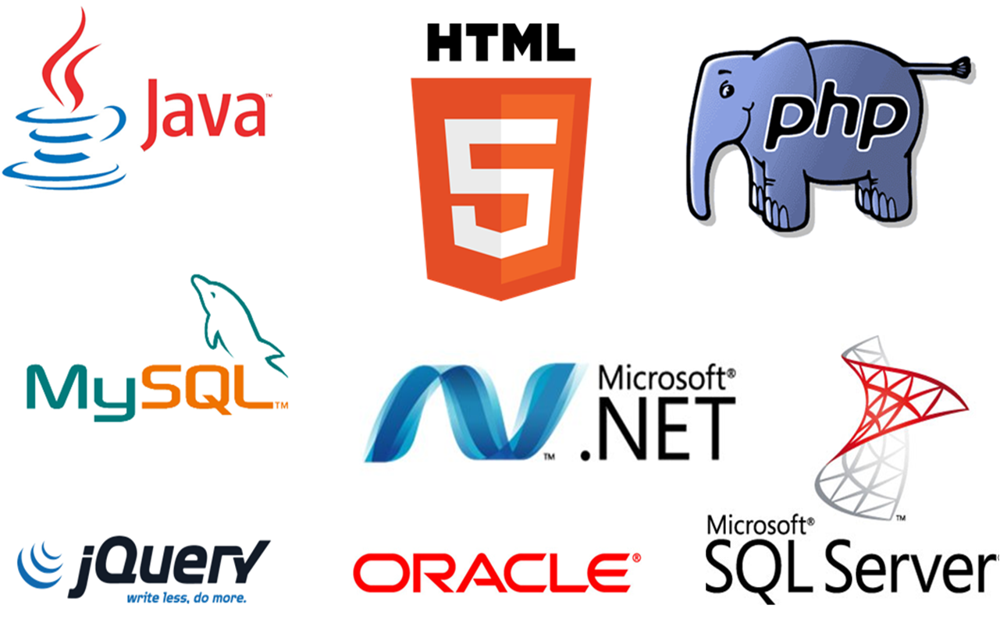
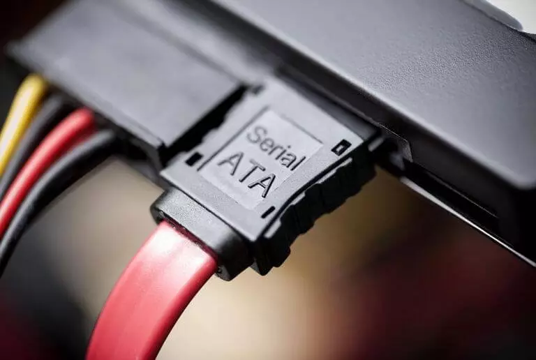

# **SOFTWARE Y HARDWARE**
## SOFTWARE:

### _SISTEMA OPERATIVO:_
###### Es un conjunto de programas que permite manejar la memoria, disco, medios de almacenamiento de información y los diferentes periféricos o recursos de nuestra computadora, como son el teclado, el mouse, la impresora, la placa de red, entre otros.Se ocupa de gestionar la memoria de nuestro sistema y la carga de los diferentes programas, para ello cada programa tiene una prioridad o jerarquía y en función de la misma contará con los recursos de nuestro sistema por más tiempo que un programa de menor prioridad.

### _APLICACIONES DE USUARIO:_
###### Una aplicación es un programa diseñado como herramienta para permitir a un usuari0 realiar uno o diversos tipos de programas, como los sistemas operativos, las utilidades, y las herramientas de desarrollo de software

### _DRIVERS:_
###### Es un software o programa que  sirve de intermediario entre un dispositivo de hardware y el sistema operativo.  Su finalidad es la de permitir extraer el máximo de las funcionalidades del dispositivo para el cual ha sido diseñado.

### _SOFTWARE DE DESARROLLO_
###### El software de desarrollo, también conocido como herramientas de desarrollo de software o entornos de desarrollo integrado (IDE), se refiere a una categoría de aplicaciones diseñadas para ayudar a los desarrolladores a crear, depurar, mantener y soportar otros programas y aplicaciones. Estas herramientas proporcionan un conjunto de funcionalidades que facilitan el proceso de desarrollo de software.

## HARDWARE:
##### El hardware se compone de:

1. CPU
2. RAM
3. Almacenamiento:
- HDD
- SSD
4. Placa base
5. Dispositivos de entrada y de salida
6. Buses:
- De datos
- De dirección

### _CPU (Unidad Central de Procesamiento):_
###### Un componente básico de todo dispositivo que procesa datos y realiza cálculos matemáticos-informáticos. El CPU proporciona la capacidad de programación y, junto con la memoria y los dispositivos de entrada/salida, es uno de los componentes presentes en la historia de los ordenadores. Algunas de las funciones básicas del CPU son recolectar información, decodificarla en partes menores y llevar a cabo instrucciones, que luego ejecuta.

### _RAM (Memoria de Acceso Aleatorio):_
###### Es la memoria principal de un dispositivo, esa donde se almacenan de forma temporal los datos de los programas que estás utilizando en este momento. La memoria RAM tiene dos características que la diferencian del resto de tipos de almacenamiento. Por una parte tiene una enorme velocidad, y por otra los datos sólo se almacenan de forma temporal. Esto quiere decir que cada vez que reinicies o apagues tu ordenador, lo normal es que los datos que haya almacenados en la RAM se pierdan.

### _Almacenamiento:_
#### - HDD:
###### Los discos duros, también conocidos como HDD, son un componente informático que sirve para almacenar de forma permanente tus datos. Esto quiere decir, que los datos no se borran cuando se apaga la unidad como pasa en los almacenados por la memoria RAM.

#### - SSD:
###### Las unidades SSD almacenan los datos mediante una memoria basada en flash, que es mucho más rápida que los discos duros tradicionales a los que han venido a sustituir. Las unidades SSD tampoco tienen piezas móviles, por lo que actualizarlas a una es una excelente manera de acelerar su ordenador y hacerlo más resistente. 

### _PLACA BASE:_
###### Es un circuito impreso al que se conectan el resto de los componentes de un ordenador para que estos funcionen de manera óptima. También se las conoce con el nombre de placas madre.

###### Su función es que todos los elementos esenciales de un PC cuenten con energía eléctrica para responder en todo momento de manera adecuada y coordinar los flujos de datos.

### _DISPOSITIVOS DE ENTRADA Y SALIDA:_
######  Es un dispositivo independiente, conectado externa o internamente a la tarjeta madre, que permite al sistema informático realizar una función extra. Como tal, no forma parte del proceso central de una computadora, sino que sirve a nivel de complemento para aumentar sus capacidades funcionales.

###### Los dispositivos periféricos son los responsables de realizar las operaciones de entrada y salida de un sistema informático. Estos artefactos se conectan a través de diversos puertos, dependiendo de la naturaleza de cada dispositivo y su conector. Algunos de estos puertos son: USB, paralelo, en serie, de audio, VGA, MIDI, y ethernet.

### _BUSES:_
#### DE DATOS:
###### Es un tipo de bus de comunicación en el que se transmiten los datos entre los diferentes componentes de una computadora o sistema. La información puede fluir en ambas direcciones, ya sea desde el ordenador hacia otros dispositivos, o desde los propios dispositivos hacia el ordenador.

###### En algunos casos, el bus de datos también puede enviar información adicional a los propios datos, como por ejemplo, bits de dirección o información sobre determinadas condiciones.

#### DE DIRECCIÓN:
###### Es un componente separado del bus de datos en un sistema cuya función principal es transmitir la dirección de memoria de la información que se desea acceder o transmitir.

###### Consiste en un grupo de líneas eléctricas que se utilizan para establecer la dirección de memoria a la que se desea acceder.

#### _Diagrama que resume la informaación presentada:_

#### REFERENCIAS:
- [Extraido de https://advantecnia.com/tipos-de-buses-de-comunicacion/#:~:text=Un%20bus%20de%20datos%20o,propios%20dispositivos%20hacia%20el%20ordenador.](https://advantecnia.com/tipos-de-buses-de-comunicacion/#:~:text=Un%20bus%20de%20datos%20o,propios%20dispositivos%20hacia%20el%20ordenador.)
- [Extraido de https://desarrollarinclusion.cilsa.org/tecnologia-inclusiva/que-es-un-sistema-operativo/](https://desarrollarinclusion.cilsa.org/tecnologia-inclusiva/que-es-un-sistema-operativo/)
- [Extraido de https://es.slideshare.net/slideshow/sistemas-operativos-y-aplicaciones-de-usuario/137189764](https://es.slideshare.net/slideshow/sistemas-operativos-y-aplicaciones-de-usuario/137189764)
- [Extraido de https://servicioalpc.com/que-son-los-drivers-o-controladores/](https://servicioalpc.com/que-son-los-drivers-o-controladores/)
- [Extraido de https://concepto.de/cpu/](https://concepto.de/cpu/)
- [Extraido de https://www.avast.com/es-es/c-what-is-ssd](https://www.avast.com/es-es/c-what-is-ssd)https://www.xataka.com/basics/hdd-vs-ssd#:~:text=Los%20discos%20duros%2C%20tambi%C3%A9n%20conocidos,almacenados%20por%20la%20memoria%20RAM.
- [https://www.xataka.com/basics/hdd-vs-ssd#:~:text=Los%20discos%20duros%2C%20tambi%C3%A9n%20conocidos,almacenados%20por%20la%20memoria%20RAM.](https://www.xataka.com/basics/hdd-vs-ssd#:~:text=Los%20discos%20duros%2C%20tambi%C3%A9n%20conocidos,almacenados%20por%20la%20memoria%20RAM.)
- [Extraido de https://www.xataka.com/basics/memoria-ram-que-sirve-como-mirar-cuanta-tiene-tu-ordenador-movil](https://www.xataka.com/basics/memoria-ram-que-sirve-como-mirar-cuanta-tiene-tu-ordenador-movil)
- [Extraido de https://www.pccomponentes.com/que-es-una-placa-base-tipos-instalar](https://www.pccomponentes.com/que-es-una-placa-base-tipos-instalar)
- [Extraido de https://www.ceupe.com/blog/periferico.html?dt=1721786290381](https://www.ceupe.com/blog/periferico.html?dt=1721786290381)
